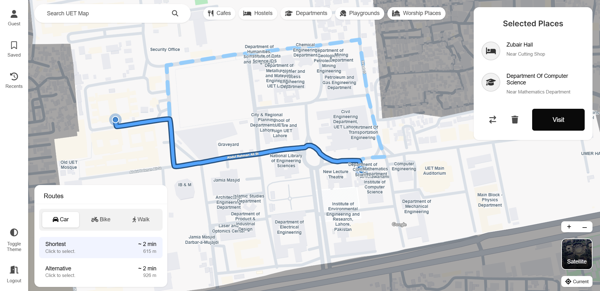
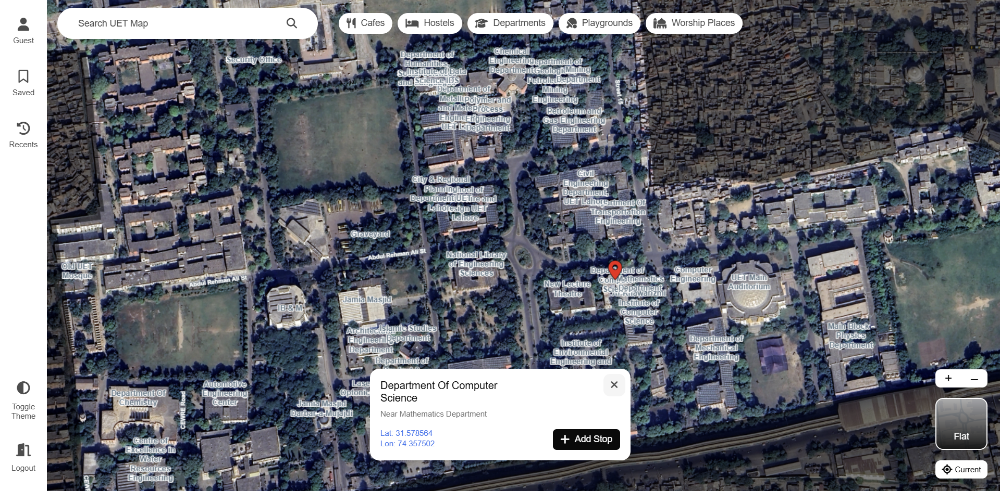
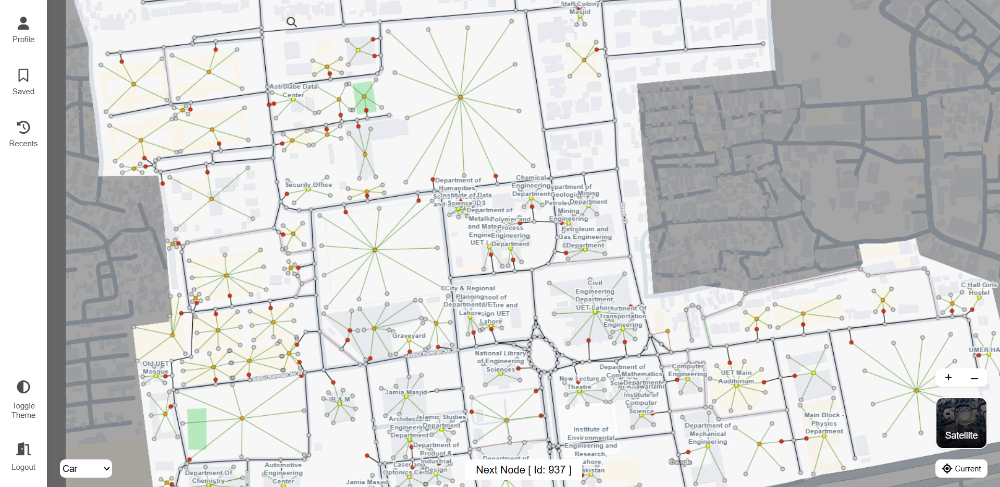
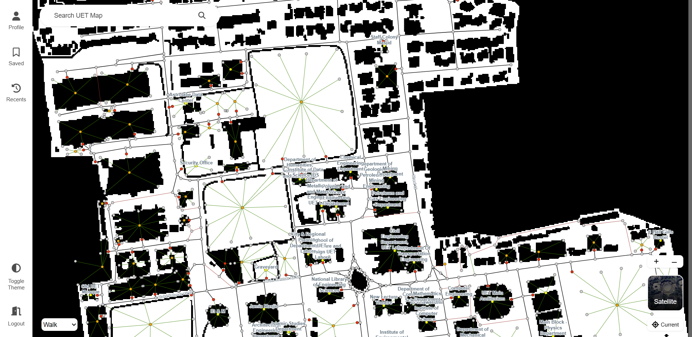

# UET Navigator

An interactive **React + Vite** web application that serves as a comprehensive digital navigation system for the **[University of Engineering and Technology (UET), Lahore](https://uet.edu.pk)**. This Map provides very in-detail and complete Map of campus, along with intelligent path finding, multiple travel modes, landmark discovery, saved locations, and an in-depth visualization of the entire campus.

The project also includes a dedicated **Map Builder**, allowing developers to visually construct and maintain the campus navigation graph without modifying application logic. Together, the Navigator and Map Builder form a complete campus navigation platform.

Live Website: https://danishhameed8767.github.io/uet-navigator/

---

# Screenshots

## Navigator (Public side)

<div align="center">
  
</div>

*Flat View*

<div align="center">
  
</div>

*Satellite View*

## Map Builder

<div align="center">
  
</div>

*Map Builder Graph*

<div align="center">
  
</div>

*Map Builder Mzae*

---

# Overview

UET Navigator transforms the conventional static campus map into an intelligent navigation system.

The application allows users to search buildings and landmarks, calculate optimal routes between locations, choose different transportation modes, save frequently visited places, add intermediate stops, and explore the campus through both standard and satellite map views.

Behind the scenes, the project uses a custom graph-based navigation engine that models the entire campus as interconnected nodes and roads. Different routing strategies are applied depending on the selected transportation mode, enabling more realistic navigation throughout the university.

---


# Tech Stack

* React
* Vite
* React Router
* React Konva
* Tailwind CSS
* JavaScript (ES6+)
* Progressive Web App (PWA)
* GitHub Pages

---

# Getting Started

## Prerequisites

Make sure the following are installed:

* Node.js
* npm

---

## 1. Clone the repository

```bash
git clone https://github.com/AhmadAmin5/UET-Navigator
cd UET-Navigator
```

---

## 2. Install dependencies

```bash
npm install
```

---

## 3. Start the development server

```bash
npm run dev
```

---

## 4. Build for production

```bash
npm run build
```

---

# Available Scripts

```bash
npm run dev          # Start development server
npm run build        # Create production build
npm run preview      # Preview production build
npm run deploy       # Deploy to GitHub Pages
```

---

# Key Features

## Interactive Campus Map

* Complete digital map of UET Lahore
* High-detail campus visualization
* Flat and satellite map views
* Smooth zooming and panning
* Interactive landmarks and buildings

---

## Intelligent Path Finding

The navigation engine computes efficient routes throughout the university using a graph-based routing system.

Features include:

* Shortest path calculation
* Dynamic route generation
* Route highlighting
* Turn-by-turn path visualization
* Automatic graph traversal

---

## Multiple Transportation Modes

Users can navigate the campus according to their preferred mode of travel.

Supported modes include:

* 🚶 Walking
* 🚲 Bicycle
* 🚗 Car

Each transportation mode follows different routing rules.

For example, walking routes can utilize narrow pathways, pedestrian streets, shortcuts, and walk-only areas that are inaccessible to vehicles, resulting in shorter and more practical routes.

---

## Smart Walking Routes

Instead of simply following roads, walking navigation intelligently prefers:

* pedestrian pathways
* internal streets
* campus shortcuts
* walking-only connections

This produces routes that closely resemble how students naturally move around campus.

---

## Search System

Users can quickly locate destinations across the university.

Supported searches include:

* Buildings
* Departments
* Offices
* Hostels
* Cafeterias
* Mosques
* Libraries
* Academic blocks
* Other campus landmarks

---

## Saved Locations

Frequently visited locations can be saved for quick access.

Examples include:

* Home Department
* Hostel
* Parking Area
* Favorite Study Spots

---

## Recent Searches

The application stores recently searched locations, making repeated navigation much faster.

---

## Multi-stop Navigation

Routes can contain multiple intermediate stops before reaching the final destination.

This is useful when visiting several buildings during a single trip.

---

## Point Information

Selecting a location displays useful information about that point, helping users better understand campus facilities and destinations.

---

## Theme Support

* Light Theme
* Dark Theme

---

## Progressive Web App

The application supports Progressive Web App features, allowing users to install the navigator directly from their browser for a more app-like experience.

---

# Map Builder

One of the core components of this project is the **Map Builder**, a dedicated tool used to create and maintain the campus navigation graph.

Instead of manually editing large datasets, developers can visually build the entire campus map.

The Map Builder supports:

* Creating navigation nodes
* Connecting roads and pathways
* Editing graph connections
* Defining different road types
* Configuring walkable pathways
* Managing landmarks
* Updating campus infrastructure
* Exporting graph data for the Navigator

By separating map creation from navigation logic, the project becomes significantly easier to maintain and extend as the campus evolves.

---

# Technical Highlights

## Graph-Based Navigation Engine

The entire university is represented as a graph where:

* Nodes represent important navigation points.
* Edges represent roads and walkways.
* Edge properties determine travel restrictions and routing behavior.

The graph is hydrated from JSON data and used by the navigation engine to calculate optimal routes.

---

## Custom Data Structures

Rather than relying solely on third-party libraries, the project implements several custom data structures, including:

* Graph
* Linked List
* Stack
* Min Heap
* Custom Map
* Custom Set

These structures power the routing algorithms and various internal operations.

---

## Routing Engine

The navigation engine employs different path-finding algorithms depending on the selected transportation mode to produce routes that are both efficient and realistic.

### Dijkstra's Algorithm

For **Car** and **Bike** navigation, the application uses **Dijkstra's Algorithm** to compute the shortest traversable path through the campus road network.

This approach is well-suited for vehicle navigation because it guarantees the shortest route while respecting the road graph and travel constraints.

Used for:

- 🚗 Car navigation
- 🚲 Bike navigation

### A* Search Algorithm

For **Walking** navigation, the application uses the **A\*** (**A-Star**) algorithm.

Unlike vehicles, pedestrians can utilize narrow pathways, shortcuts, internal streets, and walk-only connections. A* combines graph traversal with a heuristic that efficiently guides the search toward the destination, making it ideal for interactive walking navigation.

Used for:

- 🚶 Walking navigation

### Transportation-Aware Routing

Different transportation modes follow different routing rules:

- Cars travel only on vehicle-accessible roads.
- Bikes follow designated roads and pathways.
- Walking routes prioritize pedestrian paths and campus shortcuts whenever possible.

This hybrid routing strategy produces routes that closely resemble how people actually navigate the UET campus.

---

## Map Rendering

The interactive campus map is rendered using **React Konva**, enabling:

* High-performance canvas rendering
* Smooth panning
* Zoom controls
* Interactive map elements
* Dynamic route overlays

---

## Data Management

Campus information is stored in structured JSON files, allowing:

* Easy updates
* Separation of data and logic
* Maintainable map datasets
* Simplified future expansion

---

# Project Structure

```text
src/
├── components/         # Reusable UI components
├── pages/              # Application pages
├── layouts/            # Shared layouts
├── hooks/              # Custom React hooks
├── utils/              # Helper functions
├── graph/              # Graph implementation
├── algorithms/         # Path-finding logic
├── map/                # Map rendering and controls
├── data/               # Campus graph and map data
├── builder/            # Map Builder
├── assets/             # Images and static resources
├── App.jsx
└── main.jsx
```

---

## Technical Highlights

- Graph-based campus navigation engine
- Dijkstra's Algorithm for vehicle routing
- A* Search Algorithm for pedestrian navigation
- Custom Graph implementation
- React Konva-based interactive map rendering
- Progressive Web App (PWA)
- Custom Map Builder for maintaining the campus graph
- Multiple transportation modes with transportation-aware routing
- Custom data structures including Graph, Min Heap, Stack, Linked List, Map, and Set

---


# Why This Project Is Useful

UET Navigator demonstrates how modern web technologies and graph algorithms can be combined to solve real-world navigation problems within a university campus.

Beyond serving as a digital campus map, the project showcases custom graph modeling, intelligent routing, interactive map rendering, Progressive Web App development, and visual map construction through its integrated Map Builder. The modular architecture also allows the platform to be adapted for other campuses, institutions, business parks, or smart-city navigation systems with minimal changes.
